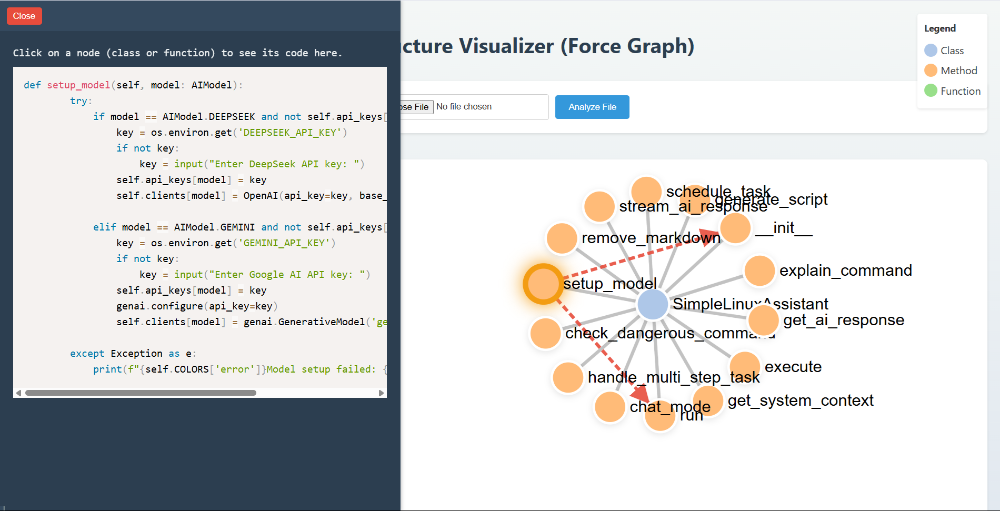

# Code Breaker - Python Code Structure Visualizer

This simple web application helps you visualize the structure of your Python code. Upload a `.py` file, and it will generate an interactive tree diagram showing the classes and functions within that file. You can click on the nodes in the tree to see the corresponding code snippet.

## Screenshot




## Features

*   **File Upload:** Accepts Python (`.py`) files.
*   **Structure Visualization:** Displays a hierarchical tree view of classes, methods, and top-level functions using D3.js.
*   **Code Snippet Display:** Click on a class or function node in the tree to view its source code directly on the page.
*   **Simple Web Interface:** Built with Flask for the backend and basic HTML/CSS/JavaScript for the frontend.

## Setup

To get this running on your local machine, follow these steps:

1.  **Prerequisites:** Make sure you have Python 3.x and pip installed.
2.  **Get the Code:** Clone this repository or download the source files (`app.py` and the `templates` folder).
3.  **Navigate to Directory:** Open your terminal or command prompt and change to the project directory where `app.py` is located.
4.  **Virtual Environment (Recommended):**
    ```bash
    python -m venv venv
    # On Windows
    .\venv\Scripts\activate
    # On macOS/Linux
    source venv/bin/activate
    ```
5.  **Install Dependencies:** The only external library needed is Flask.
    ```bash
    pip install Flask
    ```

## Running the Application

1.  Make sure you are in the project directory in your terminal and your virtual environment (if used) is activated.
2.  Run the Flask development server:
    ```bash
    python app.py
    ```
3.  Flask will start the server, usually at `http://127.0.0.1:5000`. Open this URL in your web browser.

## How to Use

1.  Once the application is running in your browser, you'll see a file input field.
2.  Click **"Choose File"** and select a Python (`.py`) file from your computer.
3.  Click the **"Analyze File"** button.
4.  An interactive tree diagram representing the code structure will appear.
5.  Click on any class or function node in the diagram.
6.  The corresponding source code for that node will be displayed in the box below the diagram.